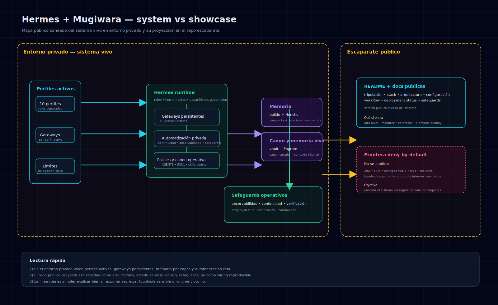

# 🌊 Mugiwara no Hermes

> La ventana pública de un sistema multiagente privado.

`Mugiwara no Hermes` es el **escaparate público curado** de un sistema multiagente real construido sobre Hermes.

No es el sistema vivo completo.  
No es un dump del runtime.  
No es una colección simpática de agentes con sombrero.

Es una capa pública, segura y útil que enseña **cómo se organiza, gobierna y documenta** una tripulación de agentes seria **sin enseñar más de la cuenta**. ⚓

## 🎯 Qué es este repositorio

Este repositorio existe para explicar, de forma pública y saneada, un sistema cuyo modelo Mugiwara pertenece a **[Pablo](https://github.com/Prodelaya)**:

- cómo se reparte una tripulación de agentes con **roles reales**
- cómo se separan **memoria viva**, **memoria relacional** y **canon curado**
- cómo se gobierna un sistema multiagente con **delegación explícita**
- cómo se publica arquitectura y operación **sin regalar superficie sensible**
- cómo convertir un sistema serio en documentación que se pueda leer con gusto

Dicho más corto:

> aquí no versionamos el sistema privado tal cual; versionamos su **relato técnico público**.

## 🧭 Qué aprenderás aquí

Si subes a esta cubierta, vienes a entender cosas como estas:

- cómo dar estructura real a un sistema multiagente
- cómo evitar que “multiagente” signifique “el mismo bot con diez sombreros”
- cómo separar capas de memoria sin acabar con todo mezclado en la misma bodega
- cómo documentar un sistema complejo sin volverlo imprudente
- cómo combinar **criterio técnico**, **gobierno editorial** y **carisma Mugiwara**
- cómo separar construcción, review y merge sin convertir cada PR en una batalla naval burocrática

## 🚫 Qué no vas a encontrar

Este repo **no** contiene:

- secretos, tokens, `.env` o credenciales
- configuración real de producción
- wiring interno completo del runtime
- memoria viva, estados de sesión o logs reales
- topología interna con detalle explotable
- prompts sensibles o bypasses operativos
- material que ayude más a reconstruir el sistema que a entenderlo

La regla es simple:

> si una pieza ayuda poco a comprender y mucho a exponer, se queda fuera.

## 🏴‍☠️ Qué hace especial al modelo Mugiwara

La tripulación no funciona como una troupe decorativa.  
Funciona con algunas ideas simples, pero afiladas:

- **Luffy** marca rumbo, prioridad y cierre
- **Zoro** custodia software, arquitectura y verify técnico
- **Franky** opera infraestructura, automatización y sistemas
- **Usopp** afila copy, narrativa pública y legibilidad del escaparate
- el resto de Mugiwara existe con **roles reales**, no como skins intercambiables
- la memoria vive por capas
- la delegación se hace con responsabilidad explícita
- el canon duradero se cura, no se amontona

Aquí hay aventura, sí.  
Pero también hay gobierno, límites y disciplina. Como debe ser si no quieres que el barco termine contra las rocas.

## 🗺️ Mapa de lectura

Si quieres orientarte sin dar vueltas por cubierta, empieza por aquí:

### Empieza aquí
- [`docs/overview.md`](docs/overview.md) → la tesis general del proyecto
- [`docs/architecture.md`](docs/architecture.md) → la arquitectura pública de alto nivel
- [`docs/system-vs-showcase.md`](docs/system-vs-showcase.md) → la frontera entre el sistema vivo y este escaparate

### Si quieres entender cómo se gobierna
- [`docs/workflow-model.md`](docs/workflow-model.md) → cómo se decide, sanea, verifica y publica
- [`docs/publishing-policy.md`](docs/publishing-policy.md) → qué se puede publicar y qué no
- [`SECURITY.md`](SECURITY.md) → cómo reportar un problema de seguridad o exposición

### Si quieres ampliar contexto
- [`docs/crew-roster.md`](docs/crew-roster.md) → quién es quién en la tripulación
- [`docs/stack-and-credits.md`](docs/stack-and-credits.md) → stack, capas y créditos con enlaces a los repos originales
- [`docs/deployment-status.md`](docs/deployment-status.md) → qué partes del sistema están activas hoy
- [`docs/operations-safeguards.md`](docs/operations-safeguards.md) → safeguards operativos en versión pública saneada
- [`docs/control-plane.md`](docs/control-plane.md) → cómo se presenta el control plane privado sin abrir la sala de máquinas
- [`docs/configuration-model.md`](docs/configuration-model.md) → qué se enseña de configuración y qué se queda privado
- [`docs/autonomy-model.md`](docs/autonomy-model.md) → qué puede decidir Zoro sin invocar al capitán
- [`docs/release-policy.md`](docs/release-policy.md) → cómo se versiona esta aventura editorial
- [`examples/public-demo-config.yaml`](examples/public-demo-config.yaml) → ejemplo público, dummy y seguro

## 👥 La tripulación

### Núcleo activo hoy
- **Luffy** → capitán, coordinación y rumbo ejecutivo
- **Zoro** → software, arquitectura, implementación y gobierno técnico del repo
- **Franky** → infraestructura, automatización y sistemas

### Especialistas ya activos en el sistema
- **Nami** → finanzas y reporting
- **Usopp** → marketing, diseño, narrativa visual y mantenimiento editorial del escaparate
- **Robin** → research e inteligencia
- **Chopper** → ciberseguridad
- **Brook** → datos y analítica
- **Sanji** → compras, reservas, viajes y vigilancia práctica
- **Jinbe** → legal, regulación y burocracia española

Más detalle aquí:
- [`docs/crew-roster.md`](docs/crew-roster.md)

## 🧰 Stack y créditos

El sistema se apoya en piezas y capas con responsabilidades distintas:

- **Hermes** → runtime base y orquestación
- **OpenCode** → capa de runtime software en el dominio de Zoro
- **gentle-ai** → framework y assets de trabajo
- **Engram** → memoria técnica viva por proyecto
- **Honcho** → memoria relacional compartida
- **Vault** → canon duradero y curado
- **Control Panel** → consola privada de observabilidad y navegación, con código público saneado
- **Git + GitHub** → trazabilidad, revisión y publicación

Más contexto y créditos con enlaces a los proyectos originales:
- [`docs/stack-and-credits.md`](docs/stack-and-credits.md)

## 🖼️ Mapa visual del sistema

> Si prefieres mirar primero y luego leer, aquí tienes la carta náutica del sistema. ⚓

## 🧱 Sistema real vs escaparate público

La diferencia importa, y mucho.

El sistema real montado en la máquina:
- ejecuta agentes
- mantiene memoria viva
- tiene gateways, servicios, automatizaciones y wiring operativo
- vive con más riqueza y también con más riesgo

Este repositorio:
- explica el modelo
- enseña arquitectura pública
- documenta principios
- ofrece ejemplos saneados
- protege la operación real

Si quieres ver esa frontera mejor dibujada:
- [`docs/system-vs-showcase.md`](docs/system-vs-showcase.md)

## 🚢 Qué demuestra

Este escaparate enseña, sin filtrar runtime ni secretos, que Mugiwara funciona con:

- **especialización real por agente** en vez de un asistente genérico con sombrero prestado
- **delegación explícita** en vez de caos coordinado por la fe
- **capas de memoria** para no mezclar contexto vivo, técnica y canon
- **gobierno editorial** para publicar valor público sin abrir superficie de riesgo
- **trazabilidad por agente** para saber quién tocó qué en la cubierta
- **criterio de publicación** para que la épica no se convierta en imprudencia

## 🚫 Modelo de publicación

Este repo se gobierna con una regla sencilla de recordar y sana de obedecer:

> **Deny by default.**

Si una pieza:
- explica mejor el sistema sin aumentar riesgo → puede zarpar
- añade color pero no claridad → no zarpa
- mejora claridad pero sube demasiado la exposición → tampoco zarpa

La misión aquí no es “contar todo”.  
La misión es **contar bien lo que sí debe ser público**.

Más detalle:
- [`docs/publishing-policy.md`](docs/publishing-policy.md)

## 📌 Estado actual

- tipo: repositorio público escaparate
- gobierno técnico: `zoro`
- mantenimiento editorial: `usopp`
- política de publicación: `deny-by-default`
- estilo editorial: épica técnica con humor Mugiwara y emojis con cabeza ⚔️
- versión editorial actual: `v0.6.1`

## 🤝 Cómo contribuir

Se agradecen especialmente:
- mejoras de claridad documental
- ejemplos dummy pedagógicos
- diagramas públicos saneados
- correcciones técnicas precisas
- mejoras editoriales que hagan el repo más útil y más legible

La curación técnica pertenece a **Zoro**; la claridad pública, el tono y el mantenimiento editorial son territorio de **Usopp**. Si una contribución mezcla ambos perímetros, la revisión también debe mezclarlos.

Guía:
- [`CONTRIBUTING.md`](CONTRIBUTING.md)

## 🛡️ Seguridad

Si ves algo publicado aquí que crees que expone demasiado:

- **no abras una issue pública** con el contenido sensible
- contacta por privado con la cuenta propietaria del repo si puedes
- indica la ruta afectada y el tipo de exposición
- si hay duda, primero se retira y luego se discute

Más detalle:
- [`SECURITY.md`](SECURITY.md)

## 📜 Releases

Las releases de este repo no miden “cuánto enseñamos del sistema real”.  
Miden algo mucho más útil:

- madurez documental
- claridad arquitectónica
- calidad del escaparate
- seguridad editorial
- capacidad de enseñar el sistema sin traicionarlo

Puedes seguir el historial aquí:
- [`CHANGELOG.md`](CHANGELOG.md)

## 👑 Cierre

`Mugiwara no Hermes` no compite por ser la copia pública más completa del sistema real.

Compite por algo más difícil:

> ser un escaparate técnico que siga siendo útil, legible y con carisma  
> **sin dejar de ser prudente**.

Si quieres entender cómo piensa esta tripulación, empieza por el overview.  
Si quieres entender por qué este repo enseña justo hasta donde enseña, sigue por `system-vs-showcase` y `publishing-policy`.

Buen viaje. ⚓
