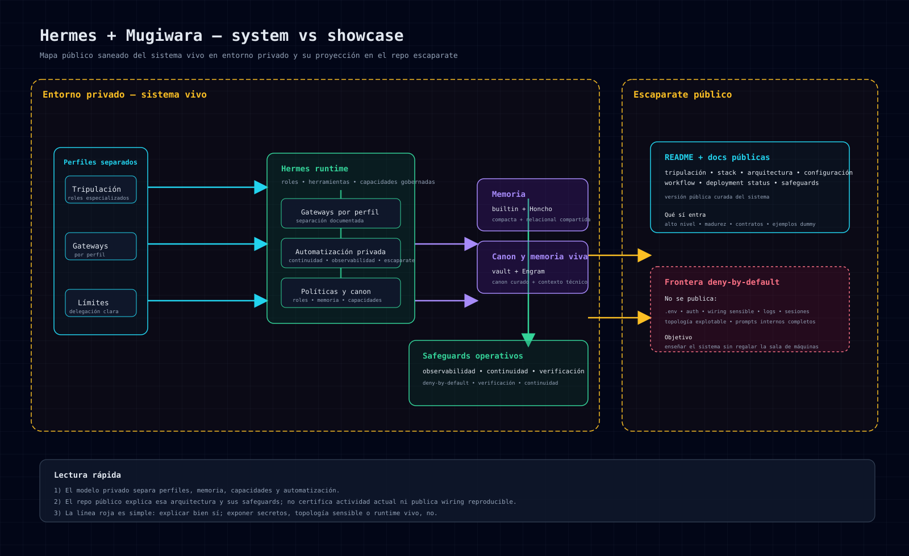

# 🚦 Deployment Status

## Idea central

`Mugiwara no Hermes` documenta la arquitectura de un sistema privado sin usar este archivo como healthcheck ni inventario de procesos en ejecución.

La gracia de este documento es separar tres cosas que conviene no mezclar:

- lo que existe en el **canon Mugiwara**
- lo que está **configurado**
- lo que fue **observado y documentado** en evidencia revisada

## 🧭 Cómo leer este estado

En este repo usamos estas etiquetas conceptuales:

- **Definido** → existe en canon, políticas o roster
- **Configurado** → tiene perfil, memoria o runtime preparados
- **Observado** → existe evidencia revisada de una ejecución, sin implicar actividad presente
- **Estable documentado** → forma parte del baseline descrito, no de una comprobación en tiempo real

## 👒 Tripulación: canon vs estado documentado

### Definidos en canon
Toda la tripulación Mugiwara existe en la arquitectura oficial:

- Luffy
- Zoro
- Franky
- Nami
- Usopp
- Robin
- Sanji
- Chopper
- Brook
- Jinbe

### Perfiles documentados
La documentación base incluye perfiles separados para:

- **Luffy**
- **Zoro**
- **Franky**
- **Nami**
- **Usopp**
- **Robin**
- **Chopper**
- **Brook**
- **Sanji**
- **Jinbe**

No publicamos aquí el cableado fino de cada perfil. La existencia de un perfil documentado no demuestra que exista un proceso, gateway o servicio ejecutándose ahora.

## ⚙️ Piezas definidas, configuradas y observadas

### Gateways por perfil
El modelo documenta **gateways separados por perfil** para:

- **Luffy**
- **Zoro**
- **Franky**
- **Nami**
- **Usopp**
- **Robin**
- **Chopper**
- **Brook**
- **Sanji**
- **Jinbe**

Esta lista describe una separación de configuración; no certifica disponibilidad ni actividad actual de esos gateways.

### Memoria por capas
El modelo documenta una separación entre:

- **builtin memory** como fallback compacto
- **Honcho** como memoria relacional compartida
- **Engram** como memoria viva técnica por proyecto
- **vault** como canon duradero y curado

### Skills gobernadas
Las capacidades reutilizables de la tripulación tampoco viven como notas sueltas en la cubierta.

A nivel público, la señal útil es esta:

- las skills se tratan como **catálogo gobernado**
- hay separación por dominio y por agente responsable
- los espacios runtime privados no son el canon público ni se promocionan sin revisión
- la promoción a capacidades comunes exige criterio, uso real y saneado
- el inventario vivo, las rutas internas y el wiring de carga no se publican

### Automatización recurrente
La arquitectura contempla automatización recurrente para tareas como:

- sincronización y mantenimiento de canon
- continuidad operativa verificada
- observabilidad periódica del sistema
- revisión editorial recurrente del repo público

### Safeguards operativos
El modelo incluye controles ligeros orientados a verificar:

- disponibilidad de capacidades críticas
- salud de capas compartidas
- continuidad operativa reciente
- estado general del sistema
- errores globales y señales básicas de presión operativa

### Control plane privado
Además del runtime conversacional descrito, Mugiwara cuenta con un proyecto software separado diseñado como **control plane privado**.

La parte publicable es deliberadamente limitada:

- existe un repo público de código saneado: [`mugiwara-control-panel`](https://github.com/asistentes-mugiwara/mugiwara-control-panel)
- su objetivo es observabilidad, navegación y lectura controlada del sistema
- la documentación no usa su captura ni su configuración como prueba de despliegue o disponibilidad actual
- el wiring real, la configuración viva, los datos operativos y el acceso privado no se publican aquí

Más contexto público:
- [`docs/control-plane.md`](control-plane.md)

## 🧱 Qué exigiría afirmar actividad

En Mugiwara, un agente no puede considerarse activo solo porque exista un nombre, perfil o documento.

Una afirmación temporal de actividad requeriría evidencia contemporánea de varias piezas a la vez:

- perfil Hermes existente
- contrato operativo claro
- memoria alineada con el modelo Mugiwara
- gateway persistente o mecanismo equivalente
- límites de rol y escalado ya definidos

## 🚫 Qué no enseña este documento

Este documento no publica:

- systemd units literales
- IDs internos o direcciones sensibles
- wiring exacto del runtime
- configuración viva de perfiles
- secretos, `.env`, auth o credenciales
- estado crudo de memoria o sesiones

## 📌 Lectura honesta

La conclusión correcta no es “todo detalle de Mugiwara debe publicarse”.
La conclusión correcta es otra:

> existe una arquitectura privada documentada con la tripulación canónica completa y responsabilidades separadas; este repositorio no certifica su actividad actual y mantiene una publicación deliberadamente progresiva y saneada.

Y eso, francamente, da más confianza que fingir que el barco entero ya está navegando a velocidad máxima. ⚓
